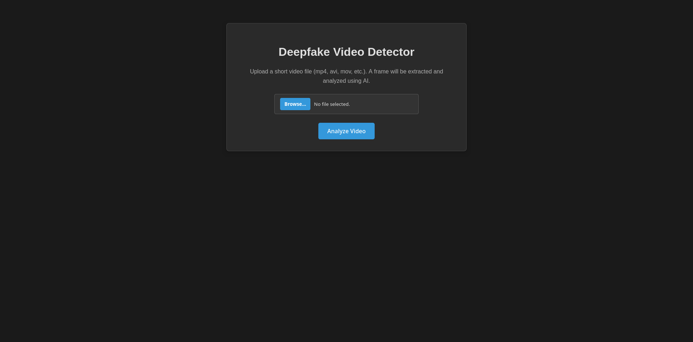
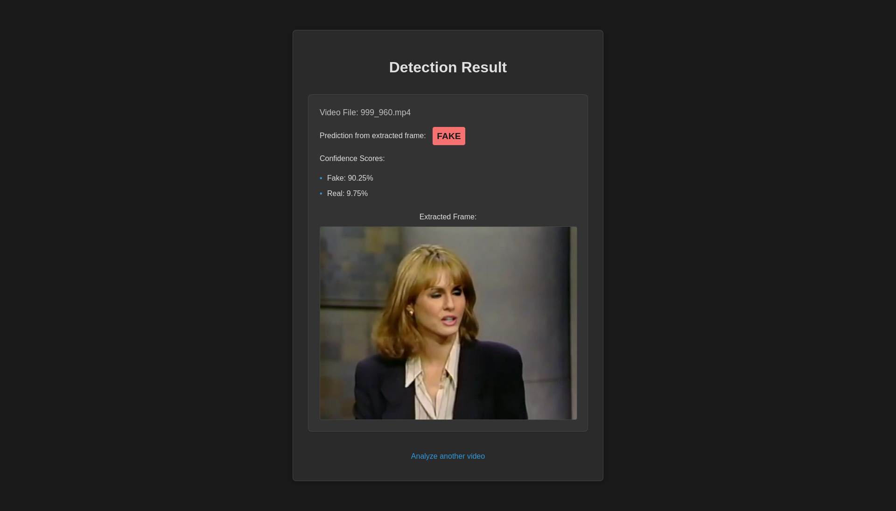
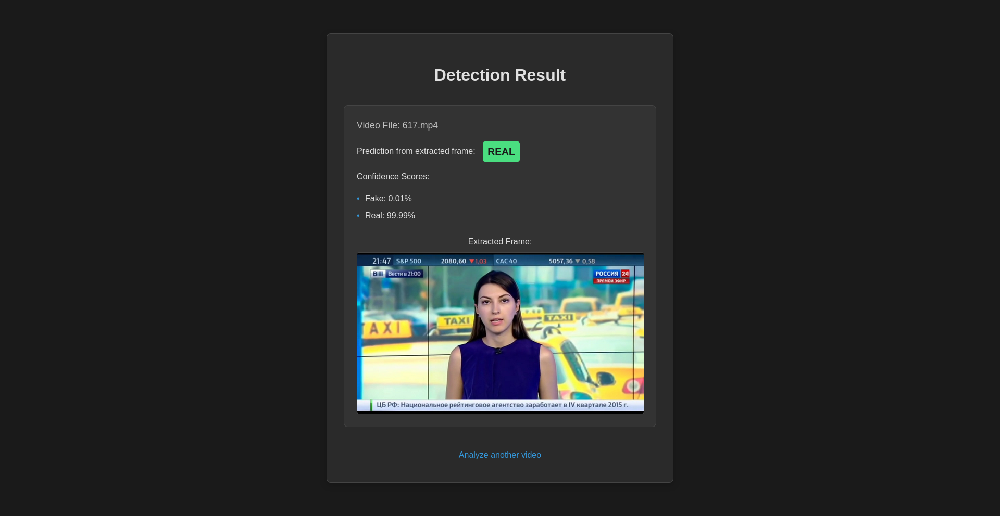

# Deepfake Video Detector 🎥❓

Is that video real or fake? This project provides a simple web tool to help you find out! In an age where AI can create realistic fake videos (deepfakes), this tool offers a quick way to check a video's authenticity.

## What it Does

This tool lets you upload a video, and it uses Artificial Intelligence (AI) to analyze it and predict whether it's likely a real video or a deepfake.

## Features ✨

*   **Easy Video Upload:** Upload videos directly from your computer through your web browser.
*   **AI-Powered Check:** Uses a smart AI model trained to spot potential signs of deepfakes.
*   **Clear Results:** Tells you simply if the video seems "Real" or "Fake".
*   **Confidence Score:** Shows how confident the AI is about its prediction.
*   **Visual Feedback:** Displays a snapshot from the video alongside the result.

## How it Works ⚙️

1.  **Upload:** You choose a video file on the main page.
2.  **Analyze:** The tool takes a look at the video using its AI detector.
3.  **Result:** It shows you the prediction ("Real" or "Fake"), how sure it is, and an image from the video you uploaded.

It's designed to be straightforward and give you a quick assessment!

## See it in Action! 📸

Here's what the tool looks like:

**1. The Upload Page**
*   This is where you start. Just click to choose your video file.

**2. The Results Page**
*   After uploading, you'll see this page. It shows:
    *   An image from your video.
    *   The AI's verdict: Real or Fake.
    *   The confidence level for the prediction.

## Why Was This Built? 🤔

Deepfakes can be used to spread misinformation or create harmful content. This tool aims to provide a simple, accessible way for anyone to get an AI-based opinion on whether a video might be manipulated.

---

*   **Please Note:** Deepfake detection is complex! While this tool uses AI, it's not perfect. Think of it as a helpful indicator, not a guaranteed proof. Always use critical thinking when viewing online content.